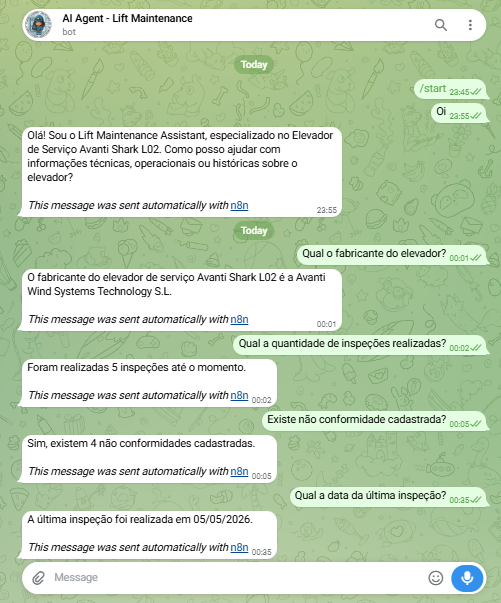
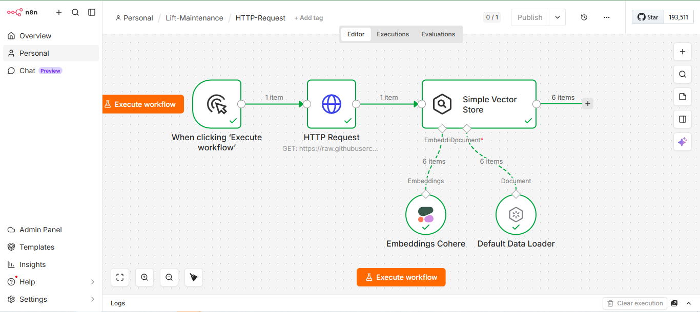
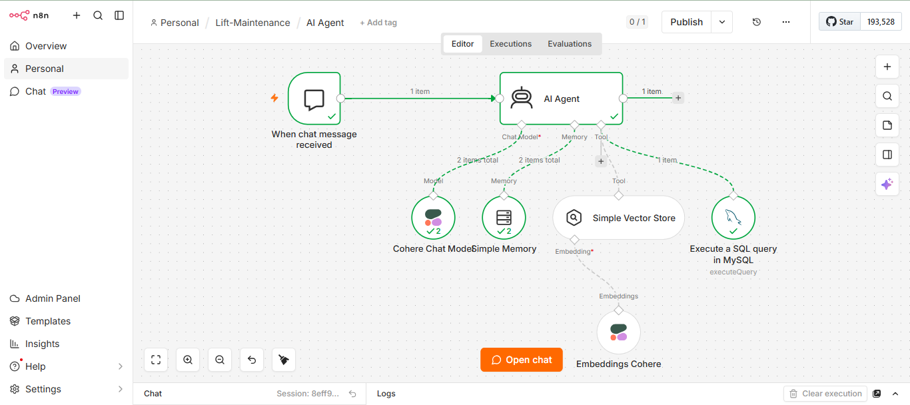
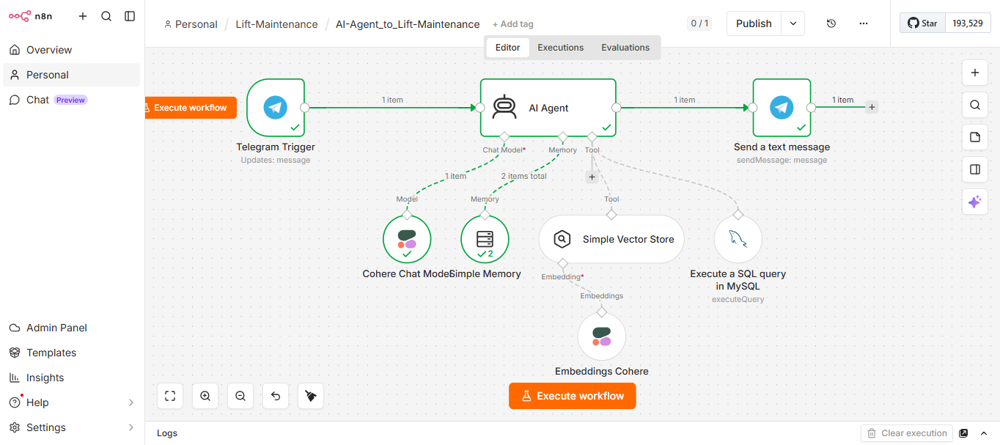

# 🤖 AI Assistant for Lift Maintenance

Assistente inteligente para manutenção industrial desenvolvido com **n8n**, **Cohere**, arquitetura **RAG (Retrieval-Augmented Generation)**, **MySQL** e **Telegram**, projetado para centralizar o conhecimento técnico e operacional do **Elevador de Serviço Avanti Shark L02** em uma única interface conversacional.

A solução permite que técnicos, inspetores e operadores consultem informações em linguagem natural diretamente pelo Telegram, combinando documentação técnica, memória conversacional e dados estruturados armazenados em banco de dados.

O bot está em execução e disponível para testes no Telegram. Sintam-se à vontade para interagir com a solução: [@liftmaintenance_bot](https://t.me/liftmaintenance_bot)

---

# 📌 Sobre o Projeto

Em ambientes industriais, informações importantes costumam estar distribuídas entre manuais técnicos, relatórios de inspeção, planilhas e bancos de dados. Isso dificulta o acesso rápido ao conhecimento necessário para atividades de operação, manutenção e diagnóstico.

Este projeto foi desenvolvido para transformar essas fontes de informação em um assistente conversacional especializado, capaz de responder perguntas técnicas e operacionais de forma rápida, contextualizada e fundamentada em dados reais.

O sistema utiliza uma arquitetura híbrida que combina:
* 📚 **Base de conhecimento documental (RAG):** Processamento do manual do equipamento.
* 🧠 **Inteligência Artificial Generativa:** LLM para compreensão e geração de respostas em linguagem natural.
* 💬 **Memória de contexto:** Manutenção do histórico da conversa para interações fluidas.
* 🗄️ **Banco de dados relacional (MySQL):** Consulta de dados operacionais e de inspeção em tempo real.
* 📱 **Interface via Telegram:** Acesso democratizado e móvel para equipes de campo.

---

# 🚀 Funcionalidades

## 📖 Consulta à Documentação Técnica
Permite realizar perguntas sobre:
* Especificações técnicas e componentes do elevador;
* Procedimentos operacionais e de descida manual;
* Dispositivos de segurança e sistema trava-quedas.

> **Exemplo:** *"Qual a capacidade máxima do elevador?"*

## 🛠️ Consulta de Dados Operacionais
Permite acessar informações armazenadas no banco de dados:
* Histórico de inspeções e não conformidades;
* Ações corretivas e dados cadastrais.

> **Exemplo:** *"Quantas inspeções foram realizadas e qual a data da última inspeção?"* (O agente mantém o contexto entre as perguntas).

---

# 🔄 Arquitetura e Workflows

O projeto é dividido em fluxos executados no n8n. Abaixo está a evolução da construção:

## 1️⃣ Ingestão de Documentos (HTTP Request & Vector Store)
Coleta o documento técnico hospedado na pasta `/context` deste repositório, gera os embeddings (via Cohere) e armazena na Vector Store para embasar a IA.

## 2️⃣ Agente de IA Conversacional
Integra o modelo de chat do Cohere com a memória conversacional e a ferramenta de busca vetorial.

## 3️⃣ Agente Completo: Integração Telegram + RAG + MySQL
O fluxo final orquestra todas as ferramentas. O agente recebe a mensagem via Telegram, decide se deve consultar o Banco de Dados (MySQL) para dados históricos, ou a Vector Store para dados do manual, consolida a resposta e devolve ao usuário.

---

# 🧠 Tecnologias Utilizadas

| Tecnologia          | Finalidade                          |
| ------------------- | ----------------------------------- |
| **n8n**             | Orquestração dos workflows          |
| **Cohere Chat**     | Modelo de linguagem (LLM) principal |
| **Cohere Embeddings**| Geração de vetores para o RAG      |
| **Vector Store**    | Armazenamento e busca semântica     |
| **MySQL**           | Armazenamento de dados estruturados |
| **Railway**         | Hospedagem do banco de dados        |
| **Telegram API**    | Interface conversacional mobile     |

---

# ⚙️ Como executar este projeto

Se você deseja replicar este assistente no seu próprio ambiente n8n, siga os passos abaixo:

### 1. Pré-requisitos
* Uma instância do [n8n](https://n8n.io/) rodando (local ou nuvem).
* Chave de API da [Cohere](https://cohere.com/).
* Um bot criado no Telegram via BotFather (Token da API).
* Um banco de dados MySQL ativo.

### 2. Configuração do Banco de Dados
Na pasta `/database` deste repositório, você encontrará o arquivo `database.sql`. Execute este script no seu MySQL para criar as tabelas (`elevadores`, `inspetores`, `inspecoes`, etc.) e popular com os dados de demonstração.

### 3. Importação dos Workflows
Na pasta `/workflows`, baixe os arquivos `.json`:
1. Abra o seu n8n.
2. Vá em *Workflows* > *Import from File* e selecione os arquivos JSON baixados.
3. Cadastre as suas próprias credenciais do Telegram, Cohere e MySQL quando o n8n solicitar.

### 4. Alimentação do RAG
O fluxo de ingestão consome automaticamente o manual técnico `avanti-shark-l02.txt` localizado na pasta `/context`. Basta executar esse fluxo uma vez para popular a Vector Store em memória antes de iniciar o chat no Telegram.

---

# 🎯 Aplicação e Benefícios
Este projeto foi desenvolvido como **prova de conceito** para a aplicação de Inteligência Artificial Generativa na manutenção industrial, utilizando o Elevador Avanti Shark L02 como ativo de referência.

A solução comprova como a redução do tempo de busca por informações e a centralização do conhecimento podem apoiar ativamente técnicos de campo, diminuindo a dependência de documentação física e entregando diagnósticos baseados em dados reais de forma escalável.

---

# 🚀 Próximos Passos

- [ ] Enriquecer o arquivo `avanti-shark-l02.txt` com mais dados extraídos do manual do equipamento.
- [ ] Aprimorar o banco de dados para tornar a estrutura mais robusta em relação aos equipamentos, com diferentes números de série, e ao histórico das inspeções simuladas cadastradas.
- [ ] Implementar a funcionalidade de "escrita", permitindo que o chatbot registre inspeções no banco de dados em nome dos inspetores autorizados.
